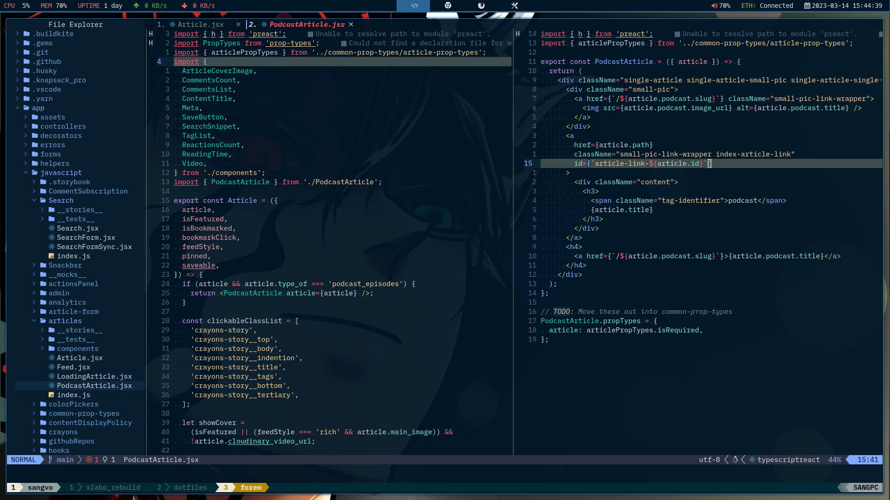

# dotfiles



My config for Vim(Neovim) Zsh ~~Alacritty~~ Wezterm Tmux

For Mac: checkout: [mac branch](https://github.com/sangvo/dotfiles/tree/mac)

## usage

- Create workspace folder
```sh
  mkdir ~/workspace
```

- Clone this repo
```sh
git clone git@github.com:sangvo/dotfiles.git ~/workspace/dotfiles
```

- Run script
```sh
cd ~/workspace/dotfiles
./install.sh
```
